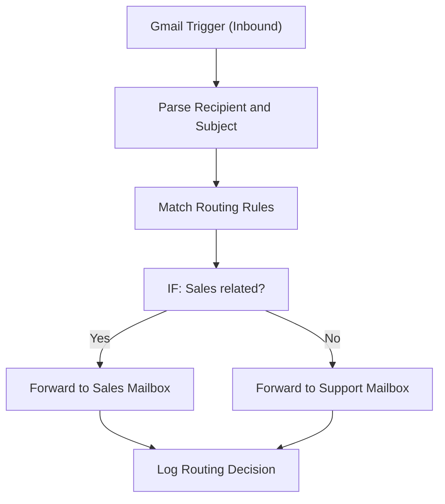

# 004 - Email Forwarding Router

> **Category:** Email & Communication

Routes inbound emails to the right department mailbox based on subject rules. Runs fully on your local machine via Docker Desktop - lifetime free.

## Architecture Diagram



## Key Nodes

| Node | Purpose |
|------|---------|
| Gmail Trigger | Inbound hook |
| Code | Extracts fields |
| Switch | Applies rules |
| Gmail Send | Forwards mail |
| IF | Fallback routing |
| SQLite | Route history |

## Dockerfile

Dockerfile: [usecases/04-email-forwarding-router/Dockerfile](https://github.com/rahuleraser/AI_Agent_LLM_011_n8n/blob/main/usecases/04-email-forwarding-router/Dockerfile)

| Detail | Value |
|--------|-------|
| Base image | `n8nio/n8n:latest` |
| Community nodes | None (built-in nodes) |
| Exposed port | 5678 |
| Persistence | `~/.n8n` volume |

### Environment defaults

- `WEBHOOK_PATH=email-route`
- `ROUTE_TABLE=json`

## Build & Run

```bash
cd usecases/04-email-forwarding-router

# Build the image
docker build -t n8n-usecase-004 .

# Run on Docker Desktop
docker run -d --name n8n-usecase-004 -p 5678:5678 \
  -v ~/.n8n:/home/node/.n8n n8n-usecase-004

# Open http://localhost:5678
```

## Docker Compose (optional)

```yaml
services:
  n8n-usecase-004:
    image: n8n-usecase-004
    container_name: n8n-usecase-004
    restart: unless-stopped
    ports: ["5678:5678"]
    volumes: ["n8n_usecase_004_data:/home/node/.n8n"]

volumes:
  n8n_usecase_004_data:
```

## Cost

$0 - no n8n license, no cloud hosting. Uses your local resources only. Any third-party API you connect (e.g. Gmail, Slack) uses its own free tier.
