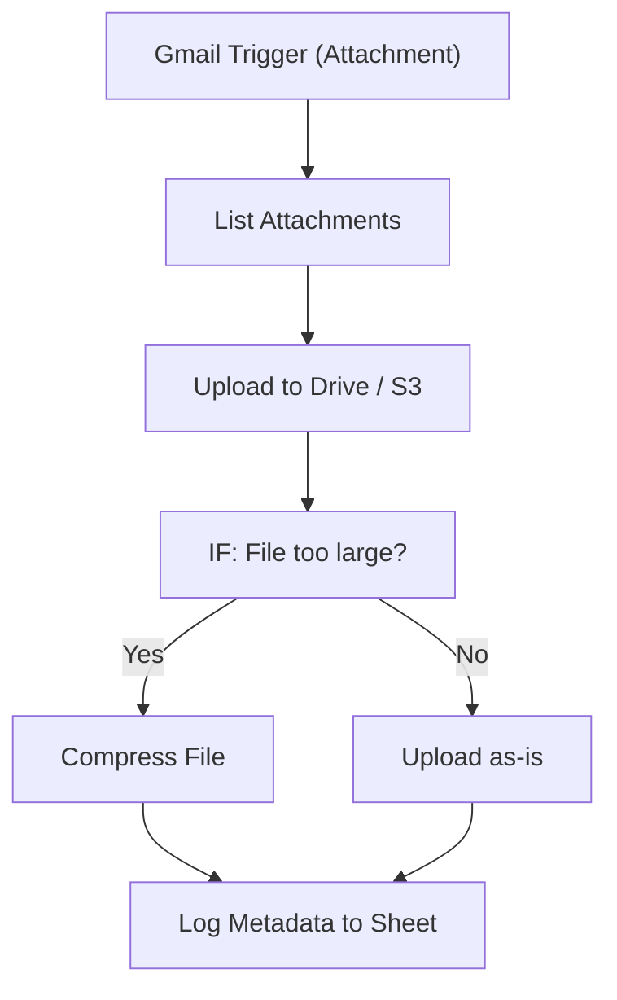

# 005 - Email Attachment Saver

> **Category:** Email & Communication

Saves email attachments to cloud storage and records metadata in a sheet. Runs fully on your local machine via Docker Desktop - lifetime free.

## Architecture Diagram



## Key Nodes

| Node | Purpose |
|------|---------|
| Gmail Trigger | Fires on attachment |
| Code | Lists files |
| Google Drive | Stores files |
| S3 | Stores files |
| IF | Size check |
| MongoDB | Metadata archive |

## Dockerfile

Dockerfile: [usecases/05-email-attachment-saver/Dockerfile](https://github.com/rahuleraser/AI_Agent_LLM_011_n8n/blob/main/usecases/05-email-attachment-saver/Dockerfile)

| Detail | Value |
|--------|-------|
| Base image | `n8nio/n8n:latest` |
| Community nodes | `n8n-nodes-mongodb` |
| Exposed port | 5678 |
| Persistence | `~/.n8n` volume |

### Environment defaults

- `WEBHOOK_PATH=attachment-save`
- `MAX_FILE_MB=25`

## Build & Run

```bash
cd usecases/05-email-attachment-saver

# Build the image
docker build -t n8n-usecase-005 .

# Run on Docker Desktop
docker run -d --name n8n-usecase-005 -p 5678:5678 \
  -v ~/.n8n:/home/node/.n8n n8n-usecase-005

# Open http://localhost:5678
```

## Docker Compose (optional)

```yaml
services:
  n8n-usecase-005:
    image: n8n-usecase-005
    container_name: n8n-usecase-005
    restart: unless-stopped
    ports: ["5678:5678"]
    volumes: ["n8n_usecase_005_data:/home/node/.n8n"]

volumes:
  n8n_usecase_005_data:
```

## Cost

$0 - no n8n license, no cloud hosting. Uses your local resources only. Any third-party API you connect (e.g. Gmail, Slack) uses its own free tier.
