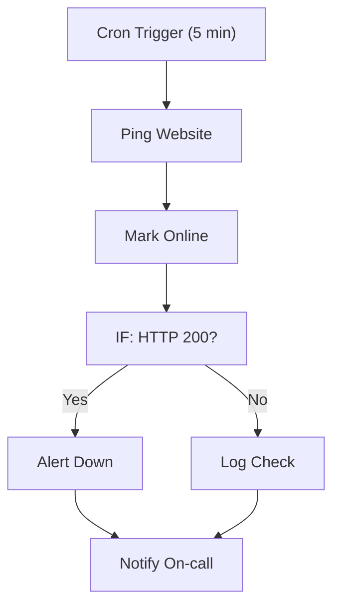

# 100 - Website Uptime Monitor

> **Category:** Developer & DevOps

Checks website uptime and alerts when a site goes down. Runs fully on your local machine via Docker Desktop - lifetime free.

## Architecture Diagram



## Key Nodes

| Node | Purpose |
|------|---------|
| Cron Trigger | Uptime poll |
| HTTP Request | Site ping |
| IF | Status check |
| Google Sheets | Online log |
| Slack | Down alert |
| Email | On-call notify |

## Dockerfile

Dockerfile: [usecases/100-website-uptime-monitor/Dockerfile](https://github.com/rahuleraser/AI_Agent_LLM_011_n8n/blob/main/usecases/100-website-uptime-monitor/Dockerfile)

| Detail | Value |
|--------|-------|
| Base image | `n8nio/n8n:latest` |
| Community nodes | None (built-in nodes) |
| Exposed port | 5678 |
| Persistence | `~/.n8n` volume |

### Environment defaults

- `UPTIME_CRON=*/5 * * * *`
- `TARGET_URL=https://example.com`

## Build & Run

```bash
cd usecases/100-website-uptime-monitor

# Build the image
docker build -t n8n-usecase-100 .

# Run on Docker Desktop
docker run -d --name n8n-usecase-100 -p 5678:5678 \
  -v ~/.n8n:/home/node/.n8n n8n-usecase-100

# Open http://localhost:5678
```

## Docker Compose (optional)

```yaml
services:
  n8n-usecase-100:
    image: n8n-usecase-100
    container_name: n8n-usecase-100
    restart: unless-stopped
    ports: ["5678:5678"]
    volumes: ["n8n_usecase_100_data:/home/node/.n8n"]

volumes:
  n8n_usecase_100_data:
```

## Cost

$0 - no n8n license, no cloud hosting. Uses your local resources only. Any third-party API you connect (e.g. Gmail, Slack) uses its own free tier.
