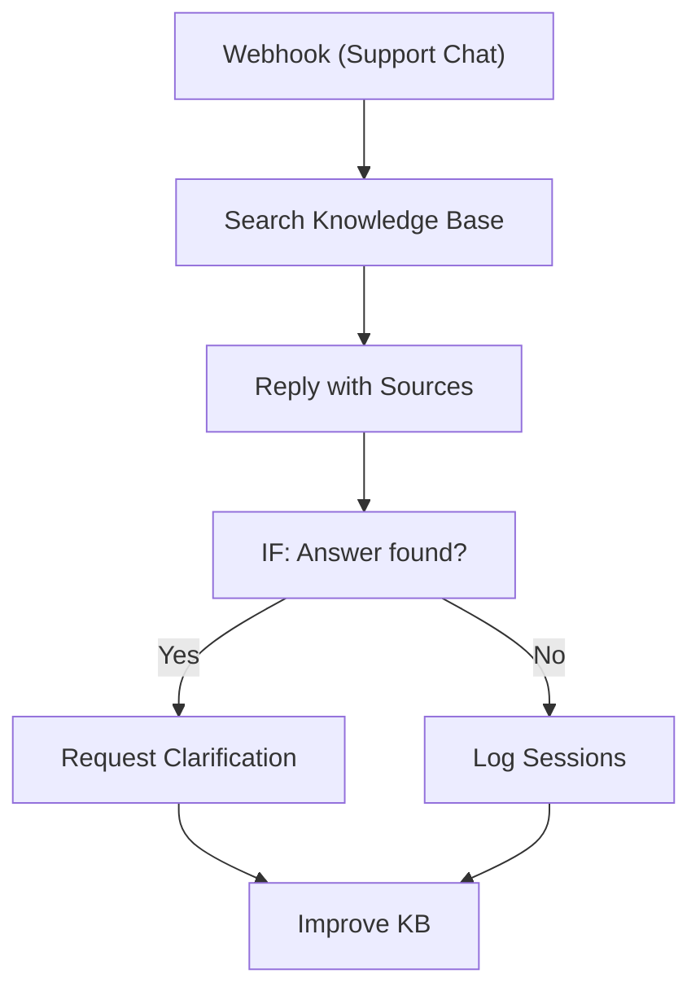

# 119 - AI Support Bot (RAG)

> **Category:** AI & LLM

Answers support questions using retrieval-augmented generation over your docs. Runs fully on your local machine via Docker Desktop - lifetime free.

## Architecture Diagram



## Key Nodes

| Node | Purpose |
|------|---------|
| Webhook | Chat message |
| Vector Store | KB search |
| AI Agent | Answer build |
| IF | Confidence check |
| Webhook | Reply send |
| SQLite | Session log |

## Dockerfile

Dockerfile: [usecases/119-ai-support-bot-rag/Dockerfile](https://github.com/rahuleraser/AI_Agent_LLM_011_n8n/blob/main/usecases/119-ai-support-bot-rag/Dockerfile)

| Detail | Value |
|--------|-------|
| Base image | `n8nio/n8n:latest` |
| Community nodes | `n8n-nodes-mcp` |
| Exposed port | 5678 |
| Persistence | `~/.n8n` volume |

### Environment defaults

- `RAG_WEBHOOK_PATH=support-bot`

## Build & Run

```bash
cd usecases/119-ai-support-bot-rag

# Build the image
docker build -t n8n-usecase-119 .

# Run on Docker Desktop
docker run -d --name n8n-usecase-119 -p 5678:5678 \
  -v ~/.n8n:/home/node/.n8n n8n-usecase-119

# Open http://localhost:5678
```

## Docker Compose (optional)

```yaml
services:
  n8n-usecase-119:
    image: n8n-usecase-119
    container_name: n8n-usecase-119
    restart: unless-stopped
    ports: ["5678:5678"]
    volumes: ["n8n_usecase_119_data:/home/node/.n8n"]

volumes:
  n8n_usecase_119_data:
```

## Cost

$0 - no n8n license, no cloud hosting. Uses your local resources only. Any third-party API you connect (e.g. Gmail, Slack) uses its own free tier.
