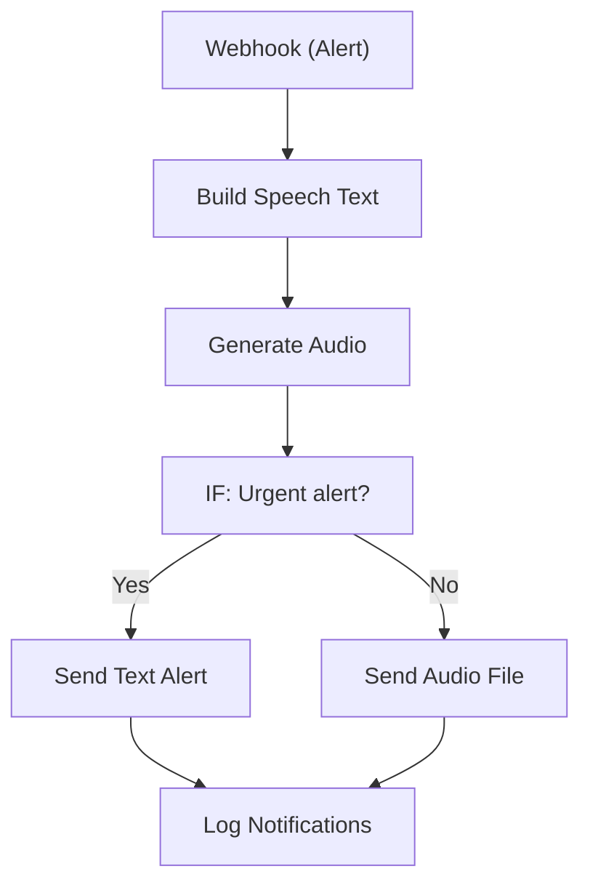

# 122 - AI Text-to-Speech Notifier

> **Category:** AI & LLM

Converts text alerts into audio notifications. Runs fully on your local machine via Docker Desktop - lifetime free.

## Architecture Diagram



## Key Nodes

| Node | Purpose |
|------|---------|
| Webhook | Alert event |
| Code | Text build |
| IF | Urgency check |
| HTTP Request | TTS API |
| Telegram | Audio send |
| SQLite | Notification log |

## Dockerfile

Dockerfile: [usecases/122-ai-text-to-speech-notifier/Dockerfile](https://github.com/rahuleraser/AI_Agent_LLM_011_n8n/blob/main/usecases/122-ai-text-to-speech-notifier/Dockerfile)

| Detail | Value |
|--------|-------|
| Base image | `n8nio/n8n:latest` |
| Community nodes | None (built-in nodes) |
| Exposed port | 5678 |
| Persistence | `~/.n8n` volume |

### Environment defaults

- `TTS_WEBHOOK_PATH=tts-alert`

## Build & Run

```bash
cd usecases/122-ai-text-to-speech-notifier

# Build the image
docker build -t n8n-usecase-122 .

# Run on Docker Desktop
docker run -d --name n8n-usecase-122 -p 5678:5678 \
  -v ~/.n8n:/home/node/.n8n n8n-usecase-122

# Open http://localhost:5678
```

## Docker Compose (optional)

```yaml
services:
  n8n-usecase-122:
    image: n8n-usecase-122
    container_name: n8n-usecase-122
    restart: unless-stopped
    ports: ["5678:5678"]
    volumes: ["n8n_usecase_122_data:/home/node/.n8n"]

volumes:
  n8n_usecase_122_data:
```

## Cost

$0 - no n8n license, no cloud hosting. Uses your local resources only. Any third-party API you connect (e.g. Gmail, Slack) uses its own free tier.
