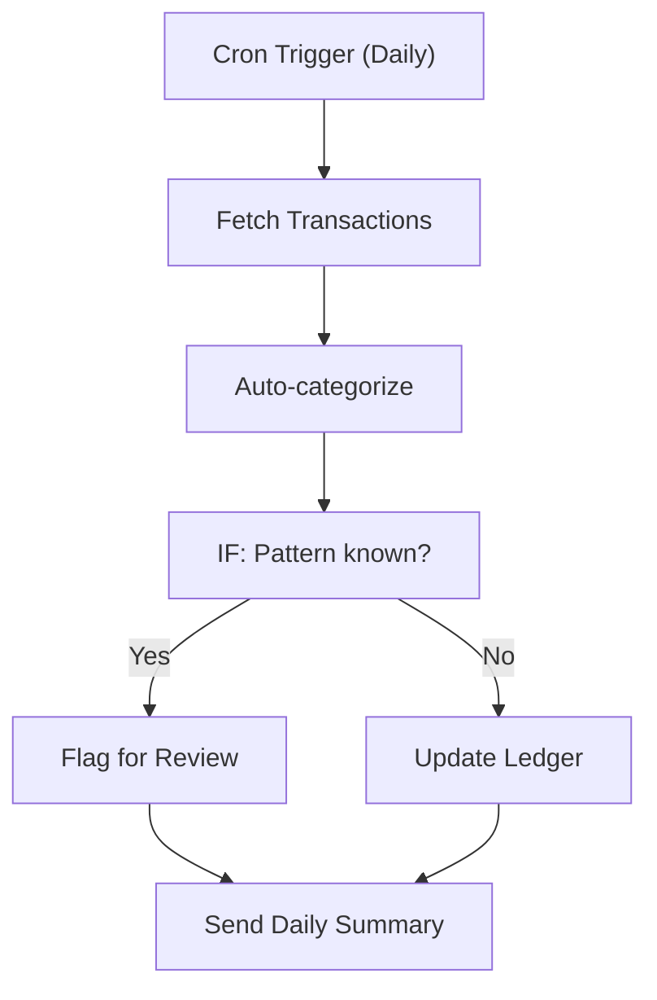

# 131 - Bank Transaction Categorizer

> **Category:** Finance & Accounting

Categorizes bank transactions for bookkeeping. Runs fully on your local machine via Docker Desktop - lifetime free.

## Architecture Diagram



## Key Nodes

| Node | Purpose |
|------|---------|
| Cron Trigger | Daily fetch |
| HTTP Request | Bank API |
| Code | Pattern match |
| IF | Category match |
| Google Sheets | Ledger |
| Email | Daily summary |

## Dockerfile

Dockerfile: [usecases/131-bank-transaction-categorizer/Dockerfile](https://github.com/rahuleraser/AI_Agent_LLM_011_n8n/blob/main/usecases/131-bank-transaction-categorizer/Dockerfile)

| Detail | Value |
|--------|-------|
| Base image | `n8nio/n8n:latest` |
| Community nodes | None (built-in nodes) |
| Exposed port | 5678 |
| Persistence | `~/.n8n` volume |

### Environment defaults

- `BANK_CRON=0 5 * * *`

## Build & Run

```bash
cd usecases/131-bank-transaction-categorizer

# Build the image
docker build -t n8n-usecase-131 .

# Run on Docker Desktop
docker run -d --name n8n-usecase-131 -p 5678:5678 \
  -v ~/.n8n:/home/node/.n8n n8n-usecase-131

# Open http://localhost:5678
```

## Docker Compose (optional)

```yaml
services:
  n8n-usecase-131:
    image: n8n-usecase-131
    container_name: n8n-usecase-131
    restart: unless-stopped
    ports: ["5678:5678"]
    volumes: ["n8n_usecase_131_data:/home/node/.n8n"]

volumes:
  n8n_usecase_131_data:
```

## Cost

$0 - no n8n license, no cloud hosting. Uses your local resources only. Any third-party API you connect (e.g. Gmail, Slack) uses its own free tier.
