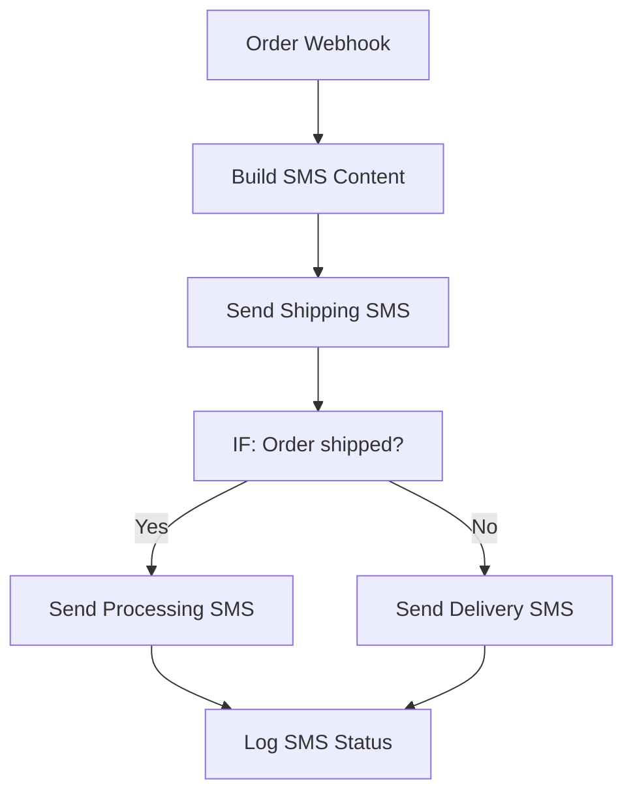

# 015 - SMS Order Notification

> **Category:** Email & Communication

Sends SMS order updates to customers after order events. Runs fully on your local machine via Docker Desktop - lifetime free.

## Architecture Diagram



## Key Nodes

| Node | Purpose |
|------|---------|
| Webhook | Order event |
| Code | Builds message |
| IF | Status branch |
| Twilio | Sends SMS |
| Spreadsheet | Order state |
| SQLite | SMS log |

## Dockerfile

Dockerfile: [usecases/15-sms-order-notification/Dockerfile](https://github.com/rahuleraser/AI_Agent_LLM_011_n8n/blob/main/usecases/15-sms-order-notification/Dockerfile)

| Detail | Value |
|--------|-------|
| Base image | `n8nio/n8n:latest` |
| Community nodes | None (built-in nodes) |
| Exposed port | 5678 |
| Persistence | `~/.n8n` volume |

### Environment defaults

- `SMS_WEBHOOK_PATH=order-sms`
- `SMS_PROVIDER=twilio`

## Build & Run

```bash
cd usecases/15-sms-order-notification

# Build the image
docker build -t n8n-usecase-015 .

# Run on Docker Desktop
docker run -d --name n8n-usecase-015 -p 5678:5678 \
  -v ~/.n8n:/home/node/.n8n n8n-usecase-015

# Open http://localhost:5678
```

## Docker Compose (optional)

```yaml
services:
  n8n-usecase-015:
    image: n8n-usecase-015
    container_name: n8n-usecase-015
    restart: unless-stopped
    ports: ["5678:5678"]
    volumes: ["n8n_usecase_015_data:/home/node/.n8n"]

volumes:
  n8n_usecase_015_data:
```

## Cost

$0 - no n8n license, no cloud hosting. Uses your local resources only. Any third-party API you connect (e.g. Gmail, Slack) uses its own free tier.
