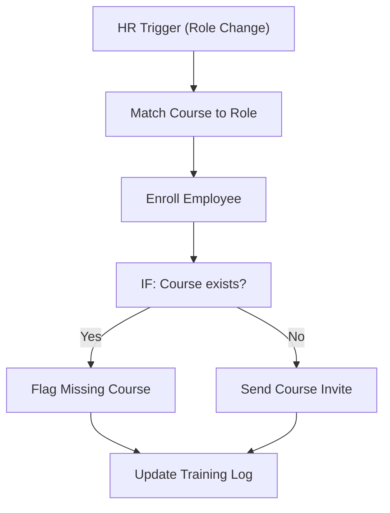

# 153 - Training Course Enroller

> **Category:** HR & Internal Ops

Enrolls employees in required training courses automatically. Runs fully on your local machine via Docker Desktop - lifetime free.

## Architecture Diagram



## Key Nodes

| Node | Purpose |
|------|---------|
| HR Trigger | Role change |
| Code | Course match |
| IF | Course check |
| Email | Invite send |
| Google Sheets | Training log |
| Slack | HR notify |

## Dockerfile

Dockerfile: [usecases/153-training-course-enroller/Dockerfile](https://github.com/rahuleraser/AI_Agent_LLM_011_n8n/blob/main/usecases/153-training-course-enroller/Dockerfile)

| Detail | Value |
|--------|-------|
| Base image | `n8nio/n8n:latest` |
| Community nodes | None (built-in nodes) |
| Exposed port | 5678 |
| Persistence | `~/.n8n` volume |

### Environment defaults

- `TRAINING_WEBHOOK_PATH=training`

## Build & Run

```bash
cd usecases/153-training-course-enroller

# Build the image
docker build -t n8n-usecase-153 .

# Run on Docker Desktop
docker run -d --name n8n-usecase-153 -p 5678:5678 \
  -v ~/.n8n:/home/node/.n8n n8n-usecase-153

# Open http://localhost:5678
```

## Docker Compose (optional)

```yaml
services:
  n8n-usecase-153:
    image: n8n-usecase-153
    container_name: n8n-usecase-153
    restart: unless-stopped
    ports: ["5678:5678"]
    volumes: ["n8n_usecase_153_data:/home/node/.n8n"]

volumes:
  n8n_usecase_153_data:
```

## Cost

$0 - no n8n license, no cloud hosting. Uses your local resources only. Any third-party API you connect (e.g. Gmail, Slack) uses its own free tier.
