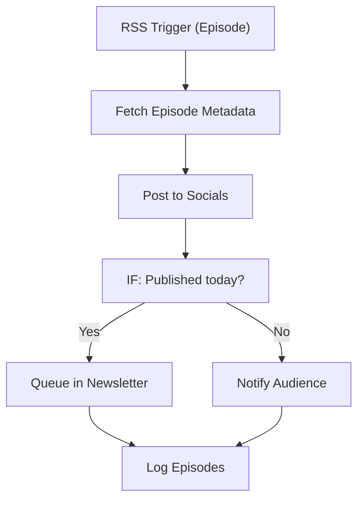

# 158 - Podcast Episode Notifier

> **Category:** Content & Publishing

Notifies listeners when new podcast episodes go live. Runs fully on your local machine via Docker Desktop - lifetime free.

## Architecture Diagram



## Key Nodes

| Node | Purpose |
|------|---------|
| RSS Trigger | New episode |
| Code | Metadata extract |
| IF | Date check |
| Twitter | Social post |
| Telegram | Audience notify |
| SQLite | Episode log |

## Dockerfile

Dockerfile: [usecases/158-podcast-episode-notifier/Dockerfile](https://github.com/rahuleraser/AI_Agent_LLM_011_n8n/blob/main/usecases/158-podcast-episode-notifier/Dockerfile)

| Detail | Value |
|--------|-------|
| Base image | `n8nio/n8n:latest` |
| Community nodes | `n8n-nodes-telegram`, `n8n-nodes-discord` |
| Exposed port | 5678 |
| Persistence | `~/.n8n` volume |

### Environment defaults

- `PODCAST_RSS=feed-url`

## Build & Run

```bash
cd usecases/158-podcast-episode-notifier

# Build the image
docker build -t n8n-usecase-158 .

# Run on Docker Desktop
docker run -d --name n8n-usecase-158 -p 5678:5678 \
  -v ~/.n8n:/home/node/.n8n n8n-usecase-158

# Open http://localhost:5678
```

## Docker Compose (optional)

```yaml
services:
  n8n-usecase-158:
    image: n8n-usecase-158
    container_name: n8n-usecase-158
    restart: unless-stopped
    ports: ["5678:5678"]
    volumes: ["n8n_usecase_158_data:/home/node/.n8n"]

volumes:
  n8n_usecase_158_data:
```

## Cost

$0 - no n8n license, no cloud hosting. Uses your local resources only. Any third-party API you connect (e.g. Gmail, Slack) uses its own free tier.
