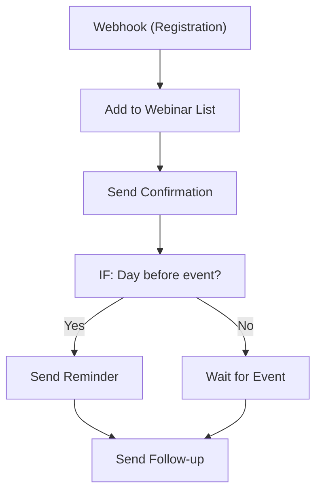

# 164 - Webinar Registration Funnel

> **Category:** Content & Publishing

Manages webinar registration and reminders. Runs fully on your local machine via Docker Desktop - lifetime free.

## Architecture Diagram



## Key Nodes

| Node | Purpose |
|------|---------|
| Webhook | Registration |
| Email | Confirmation |
| Cron Trigger | Reminder |
| Zoom | Meeting link |
| Email | Follow-up |
| Google Sheets | Attendance |

## Dockerfile

Dockerfile: [usecases/164-webinar-registration-funnel/Dockerfile](https://github.com/rahuleraser/AI_Agent_LLM_011_n8n/blob/main/usecases/164-webinar-registration-funnel/Dockerfile)

| Detail | Value |
|--------|-------|
| Base image | `n8nio/n8n:latest` |
| Community nodes | `n8n-nodes-zoom` |
| Exposed port | 5678 |
| Persistence | `~/.n8n` volume |

### Environment defaults

- `WEBINAR_WEBHOOK_PATH=webinar`
- `REMINDER_CRON=0 9 * * *`

## Build & Run

```bash
cd usecases/164-webinar-registration-funnel

# Build the image
docker build -t n8n-usecase-164 .

# Run on Docker Desktop
docker run -d --name n8n-usecase-164 -p 5678:5678 \
  -v ~/.n8n:/home/node/.n8n n8n-usecase-164

# Open http://localhost:5678
```

## Docker Compose (optional)

```yaml
services:
  n8n-usecase-164:
    image: n8n-usecase-164
    container_name: n8n-usecase-164
    restart: unless-stopped
    ports: ["5678:5678"]
    volumes: ["n8n_usecase_164_data:/home/node/.n8n"]

volumes:
  n8n_usecase_164_data:
```

## Cost

$0 - no n8n license, no cloud hosting. Uses your local resources only. Any third-party API you connect (e.g. Gmail, Slack) uses its own free tier.
