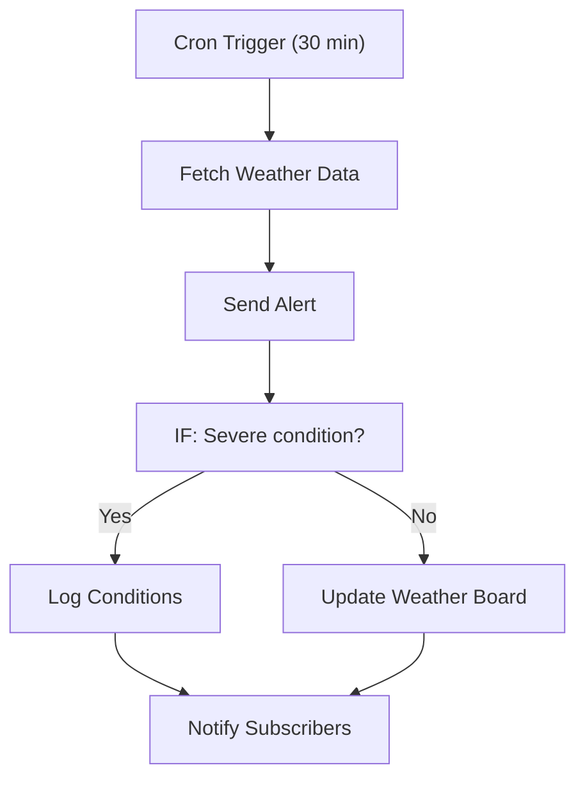

# 171 - Weather Alert System

> **Category:** IoT & Smart Home

Sends weather alerts based on live conditions and thresholds. Runs fully on your local machine via Docker Desktop - lifetime free.

## Architecture Diagram



## Key Nodes

| Node | Purpose |
|------|---------|
| Cron Trigger | Weather poll |
| OpenWeatherMap | Weather fetch |
| IF | Severity check |
| Telegram | Alert send |
| SQLite | Weather log |
| Google Sheets | Weather board |

## Dockerfile

Dockerfile: [usecases/171-weather-alert-system/Dockerfile](https://github.com/rahuleraser/AI_Agent_LLM_011_n8n/blob/main/usecases/171-weather-alert-system/Dockerfile)

| Detail | Value |
|--------|-------|
| Base image | `n8nio/n8n:latest` |
| Community nodes | `n8n-nodes-openweathermap`, `n8n-nodes-telegram` |
| Exposed port | 5678 |
| Persistence | `~/.n8n` volume |

### Environment defaults

- `WEATHER_CRON=*/30 * * * *`
- `CITY=London`

## Build & Run

```bash
cd usecases/171-weather-alert-system

# Build the image
docker build -t n8n-usecase-171 .

# Run on Docker Desktop
docker run -d --name n8n-usecase-171 -p 5678:5678 \
  -v ~/.n8n:/home/node/.n8n n8n-usecase-171

# Open http://localhost:5678
```

## Docker Compose (optional)

```yaml
services:
  n8n-usecase-171:
    image: n8n-usecase-171
    container_name: n8n-usecase-171
    restart: unless-stopped
    ports: ["5678:5678"]
    volumes: ["n8n_usecase_171_data:/home/node/.n8n"]

volumes:
  n8n_usecase_171_data:
```

## Cost

$0 - no n8n license, no cloud hosting. Uses your local resources only. Any third-party API you connect (e.g. Gmail, Slack) uses its own free tier.
