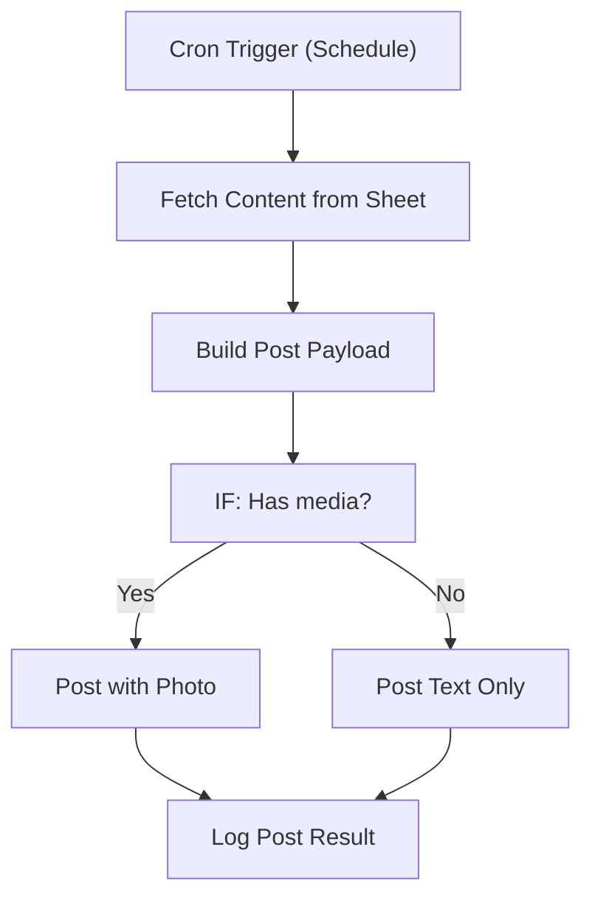

# 018 - Facebook Page Poster

> **Category:** Social Media & Communication

Posts scheduled content to a Facebook page with images. Runs fully on your local machine via Docker Desktop - lifetime free.

## Architecture Diagram



## Key Nodes

| Node | Purpose |
|------|---------|
| Cron Trigger | Schedule |
| Google Sheets | Content source |
| Facebook | Creates post |
| IF | Media branch |
| Facebook | Photo post |
| Spreadsheet | Post log |

## Dockerfile

Dockerfile: [usecases/18-facebook-page-poster/Dockerfile](https://github.com/rahuleraser/AI_Agent_LLM_011_n8n/blob/main/usecases/18-facebook-page-poster/Dockerfile)

| Detail | Value |
|--------|-------|
| Base image | `n8nio/n8n:latest` |
| Community nodes | None (built-in nodes) |
| Exposed port | 5678 |
| Persistence | `~/.n8n` volume |

### Environment defaults

- `FB_POST_CRON=0 12 * * *`
- `FB_PAGE_ID=your-page`

## Build & Run

```bash
cd usecases/18-facebook-page-poster

# Build the image
docker build -t n8n-usecase-018 .

# Run on Docker Desktop
docker run -d --name n8n-usecase-018 -p 5678:5678 \
  -v ~/.n8n:/home/node/.n8n n8n-usecase-018

# Open http://localhost:5678
```

## Docker Compose (optional)

```yaml
services:
  n8n-usecase-018:
    image: n8n-usecase-018
    container_name: n8n-usecase-018
    restart: unless-stopped
    ports: ["5678:5678"]
    volumes: ["n8n_usecase_018_data:/home/node/.n8n"]

volumes:
  n8n_usecase_018_data:
```

## Cost

$0 - no n8n license, no cloud hosting. Uses your local resources only. Any third-party API you connect (e.g. Gmail, Slack) uses its own free tier.
