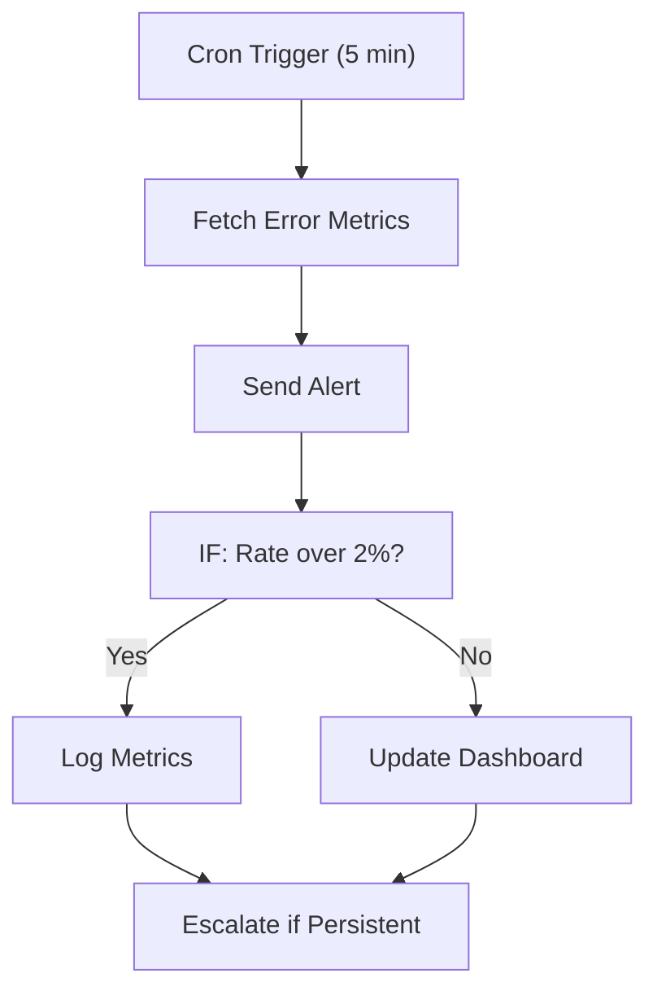

# 182 - Error Rate Threshold Alert

> **Category:** Monitoring & Alerts

Alerts when application error rates cross thresholds. Runs fully on your local machine via Docker Desktop - lifetime free.

## Architecture Diagram



## Key Nodes

| Node | Purpose |
|------|---------|
| Cron Trigger | Metrics poll |
| HTTP Request | APM API |
| IF | Threshold check |
| Slack | Alert send |
| Google Sheets | Dashboard |
| Email | Escalation |

## Dockerfile

Dockerfile: [usecases/182-error-rate-threshold-alert/Dockerfile](https://github.com/rahuleraser/AI_Agent_LLM_011_n8n/blob/main/usecases/182-error-rate-threshold-alert/Dockerfile)

| Detail | Value |
|--------|-------|
| Base image | `n8nio/n8n:latest` |
| Community nodes | None (built-in nodes) |
| Exposed port | 5678 |
| Persistence | `~/.n8n` volume |

### Environment defaults

- `ERROR_ALERT_CRON=*/5 * * * *`
- `ERROR_RATE_WARN=2`

## Build & Run

```bash
cd usecases/182-error-rate-threshold-alert

# Build the image
docker build -t n8n-usecase-182 .

# Run on Docker Desktop
docker run -d --name n8n-usecase-182 -p 5678:5678 \
  -v ~/.n8n:/home/node/.n8n n8n-usecase-182

# Open http://localhost:5678
```

## Docker Compose (optional)

```yaml
services:
  n8n-usecase-182:
    image: n8n-usecase-182
    container_name: n8n-usecase-182
    restart: unless-stopped
    ports: ["5678:5678"]
    volumes: ["n8n_usecase_182_data:/home/node/.n8n"]

volumes:
  n8n_usecase_182_data:
```

## Cost

$0 - no n8n license, no cloud hosting. Uses your local resources only. Any third-party API you connect (e.g. Gmail, Slack) uses its own free tier.
