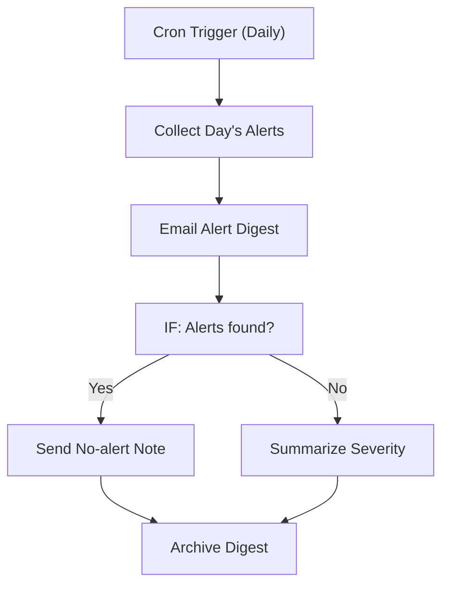

# 188 - Performance Alert Digest

> **Category:** Monitoring & Alerts

Sends a digest of all performance alerts from the day. Runs fully on your local machine via Docker Desktop - lifetime free.

## Architecture Diagram



## Key Nodes

| Node | Purpose |
|------|---------|
| Cron Trigger | End of day |
| SQLite | Alert store |
| IF | Alert check |
| Email | Digest send |
| Code | Severity summary |
| Google Sheets | Archive |

## Dockerfile

Dockerfile: [usecases/188-performance-alert-digest/Dockerfile](https://github.com/rahuleraser/AI_Agent_LLM_011_n8n/blob/main/usecases/188-performance-alert-digest/Dockerfile)

| Detail | Value |
|--------|-------|
| Base image | `n8nio/n8n:latest` |
| Community nodes | None (built-in nodes) |
| Exposed port | 5678 |
| Persistence | `~/.n8n` volume |

### Environment defaults

- `PERF_DIGEST_CRON=0 20 * * *`

## Build & Run

```bash
cd usecases/188-performance-alert-digest

# Build the image
docker build -t n8n-usecase-188 .

# Run on Docker Desktop
docker run -d --name n8n-usecase-188 -p 5678:5678 \
  -v ~/.n8n:/home/node/.n8n n8n-usecase-188

# Open http://localhost:5678
```

## Docker Compose (optional)

```yaml
services:
  n8n-usecase-188:
    image: n8n-usecase-188
    container_name: n8n-usecase-188
    restart: unless-stopped
    ports: ["5678:5678"]
    volumes: ["n8n_usecase_188_data:/home/node/.n8n"]

volumes:
  n8n_usecase_188_data:
```

## Cost

$0 - no n8n license, no cloud hosting. Uses your local resources only. Any third-party API you connect (e.g. Gmail, Slack) uses its own free tier.
