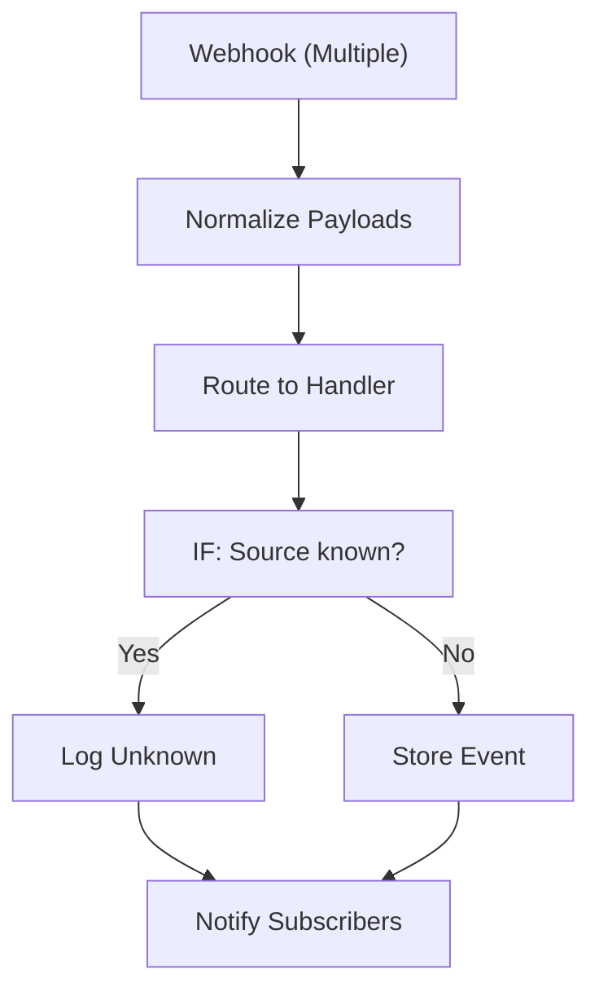

# 191 - Webhook Aggregation Gateway

> **Category:** API Integration & Automation

Aggregates multiple webhooks into one endpoint. Runs fully on your local machine via Docker Desktop - lifetime free.

## Architecture Diagram



## Key Nodes

| Node | Purpose |
|------|---------|
| Webhook | Event inbound |
| Code | Payload normalize |
| IF | Source match |
| Webhook | Route forward |
| SQLite | Event store |
| Slack | Unknown alert |

## Dockerfile

Dockerfile: [usecases/191-webhook-aggregation-gateway/Dockerfile](https://github.com/rahuleraser/AI_Agent_LLM_011_n8n/blob/main/usecases/191-webhook-aggregation-gateway/Dockerfile)

| Detail | Value |
|--------|-------|
| Base image | `n8nio/n8n:latest` |
| Community nodes | None (built-in nodes) |
| Exposed port | 5678 |
| Persistence | `~/.n8n` volume |

### Environment defaults

- `GATEWAY_WEBHOOK_PATH=gateway`

## Build & Run

```bash
cd usecases/191-webhook-aggregation-gateway

# Build the image
docker build -t n8n-usecase-191 .

# Run on Docker Desktop
docker run -d --name n8n-usecase-191 -p 5678:5678 \
  -v ~/.n8n:/home/node/.n8n n8n-usecase-191

# Open http://localhost:5678
```

## Docker Compose (optional)

```yaml
services:
  n8n-usecase-191:
    image: n8n-usecase-191
    container_name: n8n-usecase-191
    restart: unless-stopped
    ports: ["5678:5678"]
    volumes: ["n8n_usecase_191_data:/home/node/.n8n"]

volumes:
  n8n_usecase_191_data:
```

## Cost

$0 - no n8n license, no cloud hosting. Uses your local resources only. Any third-party API you connect (e.g. Gmail, Slack) uses its own free tier.
