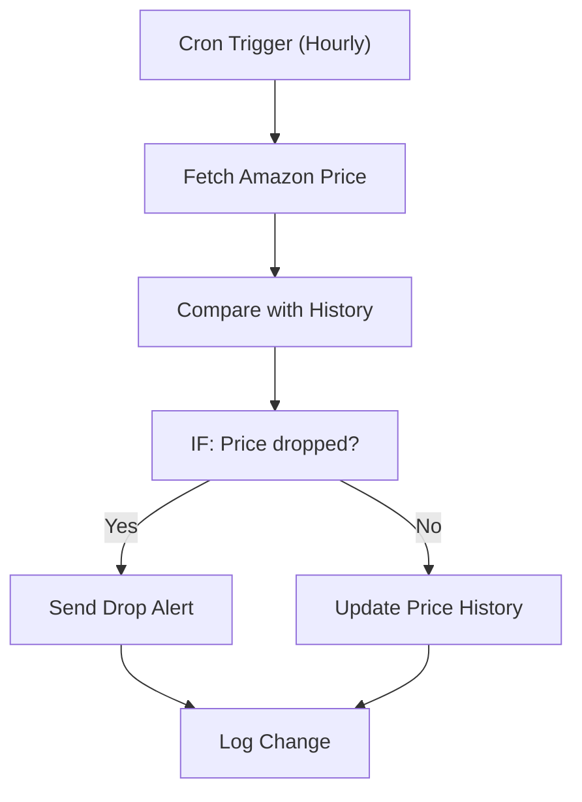

# 042 - Amazon Price Tracker

> **Category:** E-commerce & Retail

Tracks Amazon product prices and alerts on drops. Runs fully on your local machine via Docker Desktop - lifetime free.

## Architecture Diagram



## Key Nodes

| Node | Purpose |
|------|---------|
| Cron Trigger | Hourly poll |
| HTTP Request | Product data |
| Code | Price compare |
| IF | Drop detection |
| Email | Drop alert |
| SQLite | Price history |

## Dockerfile

Dockerfile: [usecases/42-amazon-price-tracker/Dockerfile](https://github.com/rahuleraser/AI_Agent_LLM_011_n8n/blob/main/usecases/42-amazon-price-tracker/Dockerfile)

| Detail | Value |
|--------|-------|
| Base image | `n8nio/n8n:latest` |
| Community nodes | `n8n-nodes-sqlite` |
| Exposed port | 5678 |
| Persistence | `~/.n8n` volume |

### Environment defaults

- `AMZ_PRICE_CRON=0 * * * *`
- `ASIN_LIST=A1B2C3D4E5`

## Build & Run

```bash
cd usecases/42-amazon-price-tracker

# Build the image
docker build -t n8n-usecase-042 .

# Run on Docker Desktop
docker run -d --name n8n-usecase-042 -p 5678:5678 \
  -v ~/.n8n:/home/node/.n8n n8n-usecase-042

# Open http://localhost:5678
```

## Docker Compose (optional)

```yaml
services:
  n8n-usecase-042:
    image: n8n-usecase-042
    container_name: n8n-usecase-042
    restart: unless-stopped
    ports: ["5678:5678"]
    volumes: ["n8n_usecase_042_data:/home/node/.n8n"]

volumes:
  n8n_usecase_042_data:
```

## Cost

$0 - no n8n license, no cloud hosting. Uses your local resources only. Any third-party API you connect (e.g. Gmail, Slack) uses its own free tier.
