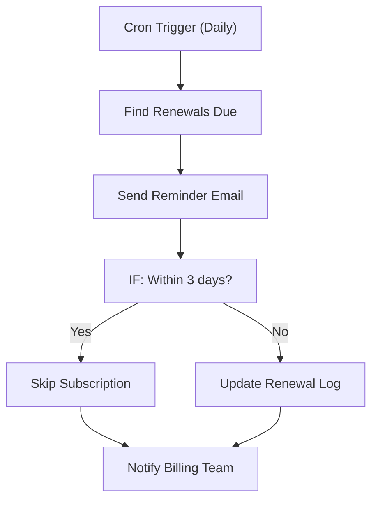

# 047 - Subscription Renewal Reminder

> **Category:** E-commerce & Retail

Reminds customers about upcoming subscription renewals. Runs fully on your local machine via Docker Desktop - lifetime free.

## Architecture Diagram



## Key Nodes

| Node | Purpose |
|------|---------|
| Cron Trigger | Daily check |
| SQLite | Subscriptions |
| IF | Window check |
| Email | Reminder send |
| Google Sheets | Renewal log |
| Slack | Billing alert |

## Dockerfile

Dockerfile: [usecases/47-subscription-renewal-reminder/Dockerfile](https://github.com/rahuleraser/AI_Agent_LLM_011_n8n/blob/main/usecases/47-subscription-renewal-reminder/Dockerfile)

| Detail | Value |
|--------|-------|
| Base image | `n8nio/n8n:latest` |
| Community nodes | None (built-in nodes) |
| Exposed port | 5678 |
| Persistence | `~/.n8n` volume |

### Environment defaults

- `RENEWAL_CRON=0 9 * * *`
- `RENEW_WINDOW_DAYS=3`

## Build & Run

```bash
cd usecases/47-subscription-renewal-reminder

# Build the image
docker build -t n8n-usecase-047 .

# Run on Docker Desktop
docker run -d --name n8n-usecase-047 -p 5678:5678 \
  -v ~/.n8n:/home/node/.n8n n8n-usecase-047

# Open http://localhost:5678
```

## Docker Compose (optional)

```yaml
services:
  n8n-usecase-047:
    image: n8n-usecase-047
    container_name: n8n-usecase-047
    restart: unless-stopped
    ports: ["5678:5678"]
    volumes: ["n8n_usecase_047_data:/home/node/.n8n"]

volumes:
  n8n_usecase_047_data:
```

## Cost

$0 - no n8n license, no cloud hosting. Uses your local resources only. Any third-party API you connect (e.g. Gmail, Slack) uses its own free tier.
