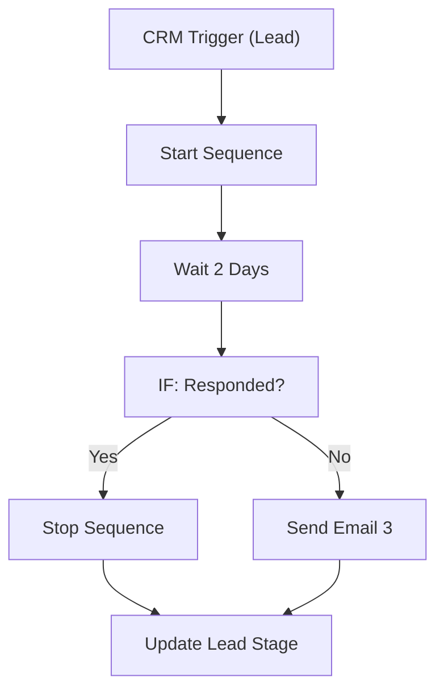

# 057 - Lead Warm-up Sequence

> **Category:** CRM & Sales

Sends a multi-touch warm-up sequence to new leads. Runs fully on your local machine via Docker Desktop - lifetime free.

## Architecture Diagram



## Key Nodes

| Node | Purpose |
|------|---------|
| CRM Trigger | New lead |
| Email Send | First touch |
| Wait | Delay between |
| IF | Response check |
| Email Send | Follow-ups |
| CRM | Stage update |

## Dockerfile

Dockerfile: [usecases/57-lead-warm-up-sequence/Dockerfile](https://github.com/rahuleraser/AI_Agent_LLM_011_n8n/blob/main/usecases/57-lead-warm-up-sequence/Dockerfile)

| Detail | Value |
|--------|-------|
| Base image | `n8nio/n8n:latest` |
| Community nodes | None (built-in nodes) |
| Exposed port | 5678 |
| Persistence | `~/.n8n` volume |

### Environment defaults

- `WARMUP_STEPS=3`
- `WARMUP_WAIT_DAYS=2`

## Build & Run

```bash
cd usecases/57-lead-warm-up-sequence

# Build the image
docker build -t n8n-usecase-057 .

# Run on Docker Desktop
docker run -d --name n8n-usecase-057 -p 5678:5678 \
  -v ~/.n8n:/home/node/.n8n n8n-usecase-057

# Open http://localhost:5678
```

## Docker Compose (optional)

```yaml
services:
  n8n-usecase-057:
    image: n8n-usecase-057
    container_name: n8n-usecase-057
    restart: unless-stopped
    ports: ["5678:5678"]
    volumes: ["n8n_usecase_057_data:/home/node/.n8n"]

volumes:
  n8n_usecase_057_data:
```

## Cost

$0 - no n8n license, no cloud hosting. Uses your local resources only. Any third-party API you connect (e.g. Gmail, Slack) uses its own free tier.
