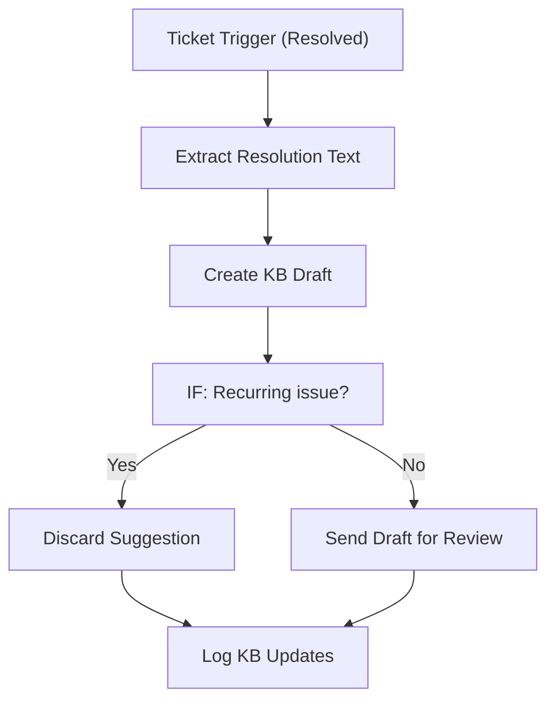

# 075 - Knowledge Base Updater

> **Category:** Support & Customer Service

Suggests knowledge base articles from resolved tickets. Runs fully on your local machine via Docker Desktop - lifetime free.

## Architecture Diagram



## Key Nodes

| Node | Purpose |
|------|---------|
| Ticket Trigger | Resolution |
| AI | Text extraction |
| IF | Recurrence check |
| Baserow | KB draft store |
| Email | Review request |
| SQLite | KB log |

## Dockerfile

Dockerfile: [usecases/75-knowledge-base-updater/Dockerfile](https://github.com/rahuleraser/AI_Agent_LLM_011_n8n/blob/main/usecases/75-knowledge-base-updater/Dockerfile)

| Detail | Value |
|--------|-------|
| Base image | `n8nio/n8n:latest` |
| Community nodes | `n8n-nodes-baserow` |
| Exposed port | 5678 |
| Persistence | `~/.n8n` volume |

### Environment defaults

- `KB_WEBHOOK_PATH=kb-draft`
- `RECUR_COUNT=5`

## Build & Run

```bash
cd usecases/75-knowledge-base-updater

# Build the image
docker build -t n8n-usecase-075 .

# Run on Docker Desktop
docker run -d --name n8n-usecase-075 -p 5678:5678 \
  -v ~/.n8n:/home/node/.n8n n8n-usecase-075

# Open http://localhost:5678
```

## Docker Compose (optional)

```yaml
services:
  n8n-usecase-075:
    image: n8n-usecase-075
    container_name: n8n-usecase-075
    restart: unless-stopped
    ports: ["5678:5678"]
    volumes: ["n8n_usecase_075_data:/home/node/.n8n"]

volumes:
  n8n_usecase_075_data:
```

## Cost

$0 - no n8n license, no cloud hosting. Uses your local resources only. Any third-party API you connect (e.g. Gmail, Slack) uses its own free tier.
