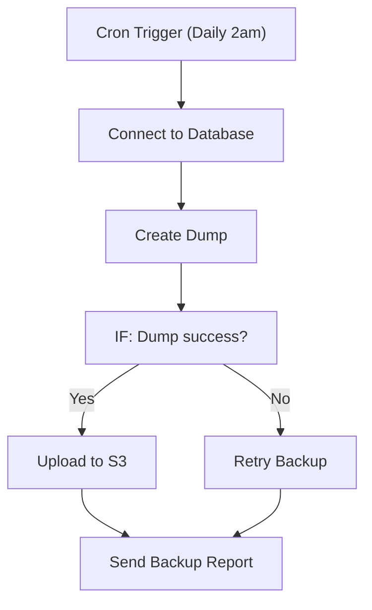

# 076 - Database Backup Scheduler

> **Category:** Data & Database

Schedules automatic backups of your databases to cloud storage. Runs fully on your local machine via Docker Desktop - lifetime free.

## Architecture Diagram



## Key Nodes

| Node | Purpose |
|------|---------|
| Cron Trigger | Backup schedule |
| Postgres | Database dump |
| Code | Dump create |
| IF | Success check |
| S3 | Upload backup |
| Email | Backup report |

## Dockerfile

Dockerfile: [usecases/76-database-backup-scheduler/Dockerfile](https://github.com/rahuleraser/AI_Agent_LLM_011_n8n/blob/main/usecases/76-database-backup-scheduler/Dockerfile)

| Detail | Value |
|--------|-------|
| Base image | `n8nio/n8n:latest` |
| Community nodes | `n8n-nodes-mongodb`, `n8n-nodes-sqlite` |
| Exposed port | 5678 |
| Persistence | `~/.n8n` volume |

### Environment defaults

- `BACKUP_CRON=0 2 * * *`
- `BACKUP_DIR=/data`

## Build & Run

```bash
cd usecases/76-database-backup-scheduler

# Build the image
docker build -t n8n-usecase-076 .

# Run on Docker Desktop
docker run -d --name n8n-usecase-076 -p 5678:5678 \
  -v ~/.n8n:/home/node/.n8n n8n-usecase-076

# Open http://localhost:5678
```

## Docker Compose (optional)

```yaml
services:
  n8n-usecase-076:
    image: n8n-usecase-076
    container_name: n8n-usecase-076
    restart: unless-stopped
    ports: ["5678:5678"]
    volumes: ["n8n_usecase_076_data:/home/node/.n8n"]

volumes:
  n8n_usecase_076_data:
```

## Cost

$0 - no n8n license, no cloud hosting. Uses your local resources only. Any third-party API you connect (e.g. Gmail, Slack) uses its own free tier.
