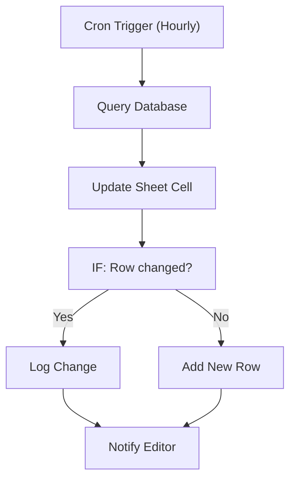

# 089 - Google Sheets Data Sync

> **Category:** Data & Database

Keeps Google Sheets in sync with a database. Runs fully on your local machine via Docker Desktop - lifetime free.

## Architecture Diagram



## Key Nodes

| Node | Purpose |
|------|---------|
| Cron Trigger | Sync poll |
| Postgres | Query rows |
| IF | Change detect |
| Google Sheets | Cell update |
| Google Sheets | Append row |
| SQLite | Sync log |

## Dockerfile

Dockerfile: [usecases/89-google-sheets-data-sync/Dockerfile](https://github.com/rahuleraser/AI_Agent_LLM_011_n8n/blob/main/usecases/89-google-sheets-data-sync/Dockerfile)

| Detail | Value |
|--------|-------|
| Base image | `n8nio/n8n:latest` |
| Community nodes | None (built-in nodes) |
| Exposed port | 5678 |
| Persistence | `~/.n8n` volume |

### Environment defaults

- `SHEET_SYNC_CRON=0 * * * *`

## Build & Run

```bash
cd usecases/89-google-sheets-data-sync

# Build the image
docker build -t n8n-usecase-089 .

# Run on Docker Desktop
docker run -d --name n8n-usecase-089 -p 5678:5678 \
  -v ~/.n8n:/home/node/.n8n n8n-usecase-089

# Open http://localhost:5678
```

## Docker Compose (optional)

```yaml
services:
  n8n-usecase-089:
    image: n8n-usecase-089
    container_name: n8n-usecase-089
    restart: unless-stopped
    ports: ["5678:5678"]
    volumes: ["n8n_usecase_089_data:/home/node/.n8n"]

volumes:
  n8n_usecase_089_data:
```

## Cost

$0 - no n8n license, no cloud hosting. Uses your local resources only. Any third-party API you connect (e.g. Gmail, Slack) uses its own free tier.
