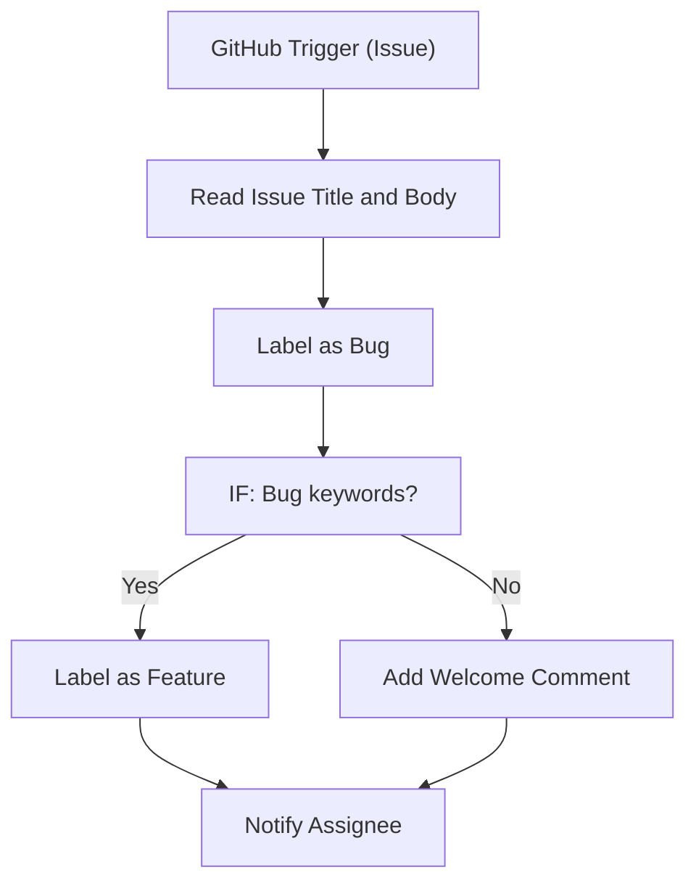

# 091 - GitHub Issue Auto-labeler

> **Category:** Developer & DevOps

Auto-labels GitHub issues based on content. Runs fully on your local machine via Docker Desktop - lifetime free.

## Architecture Diagram



## Key Nodes

| Node | Purpose |
|------|---------|
| GitHub Trigger | Issue opened |
| Code | Keyword match |
| IF | Label branch |
| GitHub | Add label |
| GitHub | Comment post |
| Slack | Assignee notify |

## Dockerfile

Dockerfile: [usecases/91-github-issue-auto-labeler/Dockerfile](https://github.com/rahuleraser/AI_Agent_LLM_011_n8n/blob/main/usecases/91-github-issue-auto-labeler/Dockerfile)

| Detail | Value |
|--------|-------|
| Base image | `n8nio/n8n:latest` |
| Community nodes | `n8n-nodes-github` |
| Exposed port | 5678 |
| Persistence | `~/.n8n` volume |

### Environment defaults

- `GITHUB_WEBHOOK_PATH=issue-label`
- `LABEL_RULES=bug,feature,docs`

## Build & Run

```bash
cd usecases/91-github-issue-auto-labeler

# Build the image
docker build -t n8n-usecase-091 .

# Run on Docker Desktop
docker run -d --name n8n-usecase-091 -p 5678:5678 \
  -v ~/.n8n:/home/node/.n8n n8n-usecase-091

# Open http://localhost:5678
```

## Docker Compose (optional)

```yaml
services:
  n8n-usecase-091:
    image: n8n-usecase-091
    container_name: n8n-usecase-091
    restart: unless-stopped
    ports: ["5678:5678"]
    volumes: ["n8n_usecase_091_data:/home/node/.n8n"]

volumes:
  n8n_usecase_091_data:
```

## Cost

$0 - no n8n license, no cloud hosting. Uses your local resources only. Any third-party API you connect (e.g. Gmail, Slack) uses its own free tier.
